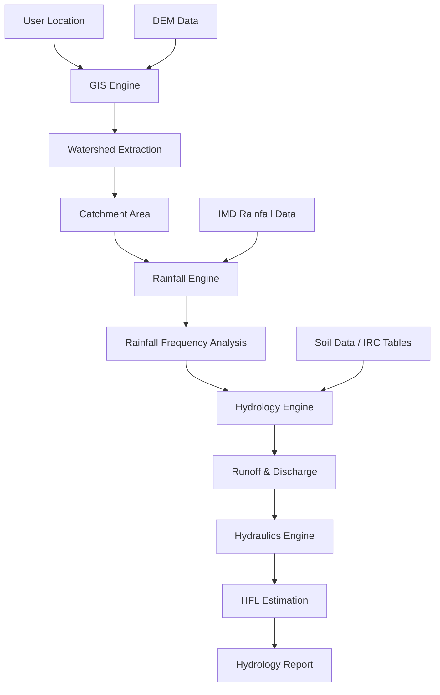

# Pi Builder

**Pi Builder** is a geospatial analysis platform for automated hydrology analysis and infrastructure planning / design support.

The system helps engineers estimate **design flood discharge and High Flood Level (HFL)** for infrastructure such as:

- bridges
- culverts
- drainage crossings
- highway structures

Pi Builder aims to automate hydrology workflows that are currently performed manually using multiple GIS software, rainfall datasets, and engineering spreadsheets.

---

# Problem

Infrastructure engineers must determine the **design flood characteristics** for a location before designing hydraulic structures.

This typically requires calculating:

- catchment area
- rainfall intensity
- runoff coefficients
- flood discharge
- high flood level (HFL)

Today this process involves multiple tools and datasets:

- IMD rainfall datasets
- DEM terrain models
- GIS watershed analysis
- Excel hydrology sheets
- IRC engineering code tables

The workflow is often:

- manual  
- time-consuming  
- difficult to reproduce  
- dependent on expert judgement

---

# Vision

Pi Builder automates hydrology analysis using geospatial computation.

# Basic Pi Builder Workflow

The platform acts as an **engineering decision engine for infrastructure planning**.

---

# Core System Components

| Component | Description |
|--------|--------|
| GIS Engine | Watershed extraction and basin analysis from DEM |
| Rainfall Engine | Rainfall frequency analysis and intensity estimation |
| Hydrology Engine | Runoff and flood discharge calculations |
| Hydraulics Engine | High Flood Level (HFL) estimation |
| Report Engine | Automated hydrology report generation |

---

# Repository Structure
pibuilder/
  docs/ # project documentation and specifications
  src/ # core source code
  tests/ # automated tests
  data/ # datasets and sample inputs
  notebooks/ # exploration and analysis notebooks

---

# Documentation

Detailed project documentation lives in the `docs` directory.

Start here: docs/README.md

Key documentation sections include:
- Hydrology methodology
- Rainfall analysis
- GIS watershed extraction
- Algorithms and computation
- System architecture
- Engineering roadmap
- SME knowledge capture

---

# Development Setup

Clone the repository:

git clone https://github.com/pifoundrylz/pibuilder.git
cd pibuilder

Create a Python environment:

python -m venv venv
source venv/bin/activate

Install dependencies:

pip install -r requirements.txt

---

# Current Development Status

pi Builder is currently in **early development**.

The first milestone is implementing the **GIS watershed extraction engine**.

Initial capability:

Input: map coordinate
Output: watershed / catchment boundary

This forms the foundation for all downstream hydrology calculations.

---

# Project Roadmap

Short-term milestones:

1. DEM ingestion and watershed extraction
2. Rainfall frequency analysis engine
3. Runoff and flood discharge calculations
4. HFL estimation
5. Hydrology report generation
6. Web-based map interface

---

# Contributing

Project architecture and technical specifications are documented in the `docs` directory.

Contributions, ideas, and technical discussions are welcome.

---

# License

TBD

