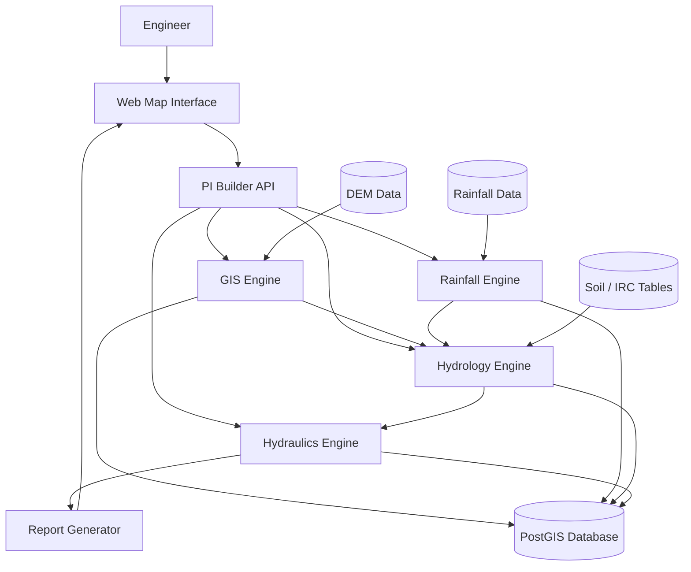

# PI Builder — System Architecture

PI Builder is a **geospatial computation platform** designed to automate hydrology analysis for infrastructure design workflows such as bridges, culverts, and drainage structures.

The system separates responsibilities into modular layers so that heavy geospatial computations can scale while development remains fast during the MVP stage.

---

# Architecture Overview

# PI Builder – System Architecture

PI Builder is designed as a **modular service-oriented backend with asynchronous compute workers**.  
The goal is to support heavy geospatial and hydrological computation while allowing rapid iteration toward an MVP.

The architecture is composed of five logical layers:

1. User Interface  
2. API Layer  
3. Domain Services  
4. Asynchronous Compute Workers  
5. Data Layer

Each layer has a clear responsibility and communicates with adjacent layers through well-defined interfaces.

---

# 1. User Interface Layer

The user interface is the entry point to the system.

Its primary responsibilities are:

- displaying a map interface
- allowing engineers to select a location
- visualizing catchments and analysis outputs
- displaying hydrology reports

Typical workflow from the UI:

1. Engineer selects a point on the map.
2. The frontend sends the coordinates to the backend API.
3. The UI periodically polls for computation results.
4. Once processing completes, the UI displays results such as catchment boundaries, discharge estimates, and HFL.

For the MVP, this layer can be implemented with:

- React + Leaflet
- React + Mapbox

Alternatively, a lightweight prototype can use:

- Streamlit

---

# 2. API Layer

The API layer acts as the **orchestrator of the system**.

Its responsibilities include:

- receiving requests from the frontend
- validating inputs
- coordinating computation across services
- triggering asynchronous jobs
- returning results to the UI

The API should remain lightweight and should not perform heavy computations directly.

Example endpoints might include:

# PI Builder – System Architecture

PI Builder is designed as a **modular service-oriented backend with asynchronous compute workers**.  
The goal is to support heavy geospatial and hydrological computation while allowing rapid iteration toward an MVP.

The architecture is composed of five logical layers:

1. User Interface  
2. API Layer  
3. Domain Services  
4. Asynchronous Compute Workers  
5. Data Layer

Each layer has a clear responsibility and communicates with adjacent layers through well-defined interfaces.

---

# 1. User Interface Layer

The user interface is the entry point to the system.

Its primary responsibilities are:

- displaying a map interface
- allowing engineers to select a location
- visualizing catchments and analysis outputs
- displaying hydrology reports

Typical workflow from the UI:

1. Engineer selects a point on the map.
2. The frontend sends the coordinates to the backend API.
3. The UI periodically polls for computation results.
4. Once processing completes, the UI displays results such as catchment boundaries, discharge estimates, and HFL.

For the MVP, this layer can be implemented with:

- React + Leaflet
- React + Mapbox

Alternatively, a lightweight prototype can use:

- Streamlit

---

# 2. API Layer

The API layer acts as the **orchestrator of the system**.

Its responsibilities include:

- receiving requests from the frontend
- validating inputs
- coordinating computation across services
- triggering asynchronous jobs
- returning results to the UI

The API should remain lightweight and should not perform heavy computations directly.

Example endpoints might include:

- POST /watershed
- POST /rainfall-analysis
- POST /discharge
- POST /hfl
- GET /report/{project_id}

Recommended framework for the API:

**FastAPI**

Advantages include:

- high performance
- async support
- automatic OpenAPI documentation
- strong typing

---

# 3. Domain Services Layer

The domain services layer contains the **core engineering logic** of the platform.

Each service corresponds to a major component of the hydrology workflow.

The primary services are:

- GIS Service  
- Rainfall Service  
- Hydrology Service  
- Hydraulics Service  
- Report Service  

These services are implemented as Python modules within the same application rather than independent microservices.  
This approach allows faster development and simpler deployment.

---

## 3.1 GIS Service

The GIS service is responsible for terrain-based analysis.

Key functions include:

- loading DEM terrain data
- computing flow direction
- computing flow accumulation
- extracting river networks
- delineating watershed boundaries
- calculating catchment metrics

The GIS service is the **foundation of the entire platform**.

All downstream hydrology calculations depend on the catchment geometry extracted here.

---

## 3.2 Rainfall Service

The rainfall service performs statistical analysis on rainfall datasets.

Responsibilities include:

- ingesting rainfall datasets
- cleaning rainfall time series
- performing frequency analysis
- estimating rainfall intensity for specific return periods

Common statistical methods include:

- Log Pearson Type III
- curve fitting approaches

The output of this service is rainfall intensity associated with the design return period.

---

## 3.3 Hydrology Service

The hydrology service converts rainfall into flood discharge.

Responsibilities include:

- determining runoff coefficients
- applying empirical flood formulas
- computing peak discharge values

Inputs include:

- rainfall intensity
- catchment area
- soil characteristics
- terrain slope

Outputs include estimated flood discharge.

---

## 3.4 Hydraulics Service

The hydraulics service converts flood discharge into water level estimates.

Responsibilities include:

- estimating High Flood Level (HFL)
- applying hydraulic relationships
- evaluating channel characteristics

Inputs include:

- discharge
- channel slope
- roughness characteristics
- river cross section

The primary output is the **High Flood Level at the site**.

---

## 3.5 Report Service

The report service generates engineering documentation.

Responsibilities include:

- compiling all results
- generating structured hydrology reports
- exporting outputs to formats such as PDF

The generated reports should resemble hydrology calculations typically included in DPR submissions.

---

# 4. Asynchronous Compute Workers

Many geospatial and hydrological computations are computationally expensive.

Examples include:

- watershed extraction
- large raster processing
- rainfall statistical analysis

These tasks should not run directly within the API request cycle.

Instead, they are delegated to **background worker processes**.

Typical workflow:

1. API receives request.
2. API places job on a queue.
3. Worker processes execute the job.
4. Results are stored in the database.
5. API returns results to the frontend.

This architecture allows:

- long-running computations
- horizontal scaling of workers
- better user responsiveness

A simple implementation can use:

- **RQ + Redis**

More advanced implementations could later use **Celery**.

---

# 5. Data Layer

The data layer consists of two categories of data:

1. external datasets  
2. internal system data

---

## 5.1 External Datasets

The platform depends on several geospatial datasets.

### DEM Terrain Data

Used for watershed extraction and terrain analysis.

### Rainfall Data

Obtained from:

- IMD gridded datasets
- rain gauge stations

### Soil and Runoff Tables

Derived from engineering codes such as IRC guidelines.

These datasets are typically stored as raster files or geospatial datasets.

---

## 5.2 Internal System Data

The platform also stores internally generated data.

Examples include:

- project definitions
- watershed geometries
- rainfall analysis results
- hydrology calculation outputs
- generated reports

Recommended database:

**PostgreSQL + PostGIS**

PostGIS allows efficient storage and querying of geospatial geometries.

---

# Data Flow Through the System

The typical execution flow for a project is:

1. User selects a location on the map.
2. The UI sends the coordinates to the API.
3. The API triggers a GIS job to delineate the watershed.
4. The GIS service computes catchment geometry.
5. The rainfall service determines rainfall intensity for the return period.
6. The hydrology service calculates peak discharge.
7. The hydraulics service estimates the High Flood Level.
8. The report service generates a hydrology report.
9. Results are returned to the user interface.

---

# Why This Architecture Was Chosen

This architecture balances **development speed and future scalability**.

Advantages include:

- simple deployment
- clear separation of responsibilities
- parallel development by multiple engineers
- ability to scale compute-heavy tasks later

The architecture intentionally avoids early complexity such as:

- microservices
- distributed orchestration systems
- container clusters

These can be introduced later if the product grows.

---

# Path to Future Scaling

As the platform grows, this architecture can evolve naturally.

Possible future changes include:

- splitting services into independent microservices
- moving workers into distributed compute clusters
- introducing data pipelines for rainfall ingestion
- adding machine learning models for flood prediction

None of these are necessary for the initial MVP.

---

# MVP Focus

The most important subsystem to implement first is the **GIS watershed extraction pipeline**.

Everything else in the hydrology workflow depends on this capability.

The first milestone should therefore be:

> Given a coordinate, the system returns the upstream watershed boundary and catchment area.

Once this capability exists, rainfall analysis and discharge estimation can be layered on top.

