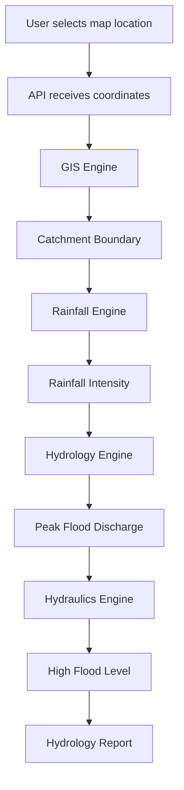

# PI Builder — Data Flow Architecture

This document explains how data moves through the PI Builder system from user input to final hydrology report generation.

---

# End-to-End Data Flow

---

# Step-by-Step Data Flow

## Step 1 — Site Selection

User selects a site on the map.

Inputs:

latitude  
longitude

The coordinates are sent to the API.

---

## Step 2 — Watershed Extraction

The API triggers the GIS engine.

Inputs:

- DEM terrain dataset
- Outlet coordinate

Processing:

- Terrain preprocessing
- Flow direction computation
- Flow accumulation
- Watershed delineation

Output:

- Catchment polygon
- Catchment area

---

## Step 3 — Rainfall Analysis

Rainfall engine determines rainfall intensity.

Inputs:

- Rainfall grids
- Rain gauge data

Processing:

- Data cleaning
- Annual maxima extraction
- Frequency analysis

Output:

Rainfall intensity for the design return period.

---

## Step 4 — Runoff Calculation

Hydrology engine calculates peak discharge.

Inputs:

- Rainfall intensity
- Catchment area
- Runoff coefficient

Output:

Peak flood discharge.

---

## Step 5 — Hydraulic Calculation

Hydraulics engine converts discharge into flood level.

Inputs:

- Discharge
- River channel characteristics

Output:

High Flood Level (HFL)

---

## Step 6 — Report Generation

Results are compiled into a hydrology report.

Report includes:

- Watershed map
- Rainfall statistics
- Discharge calculations
- HFL estimate

Outputs:

- PDF report
- Downloadable analysis results