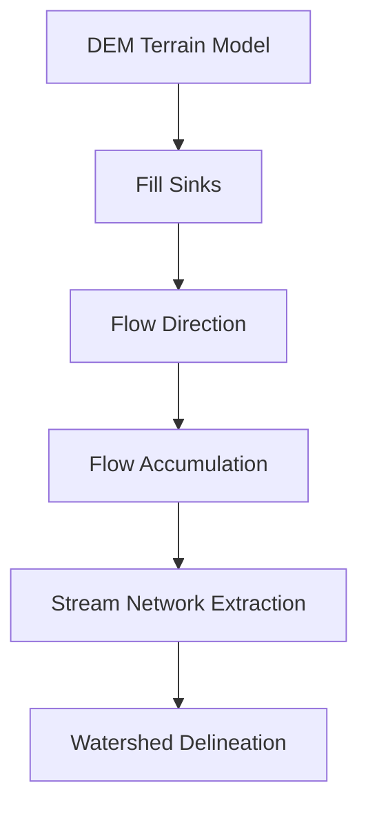

# DEM Processing Pipeline

```mermaid
flowchart TD

DEM[DEM Terrain Model]
DEM --> FILL[Fill Sinks]
FILL --> FLOWDIR[Flow Direction]
FLOWDIR --> FLOWACC[Flow Accumulation]
FLOWACC --> STREAM[Stream Network Extraction]
STREAM --> BASIN[Watershed Delineation]
```