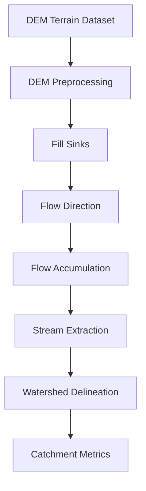

# Geospatial Processing Architecture

The geospatial processing layer is the computational foundation of PI Builder.

This layer transforms terrain data and coordinates into hydrological basin information.

## Core Objective

Given a geographic coordinate, determine:

- upstream catchment boundary
- catchment area
- drainage network
- terrain characteristics

---

## Geospatial Processing Stack

Recommended libraries:

- rasterio
- geopandas
- shapely
- pyproj
- whitebox-tools

---

## Processing Pipeline

---

## Key Steps

### DEM Preprocessing

Tasks:

- reproject raster
- clip DEM to region
- validate resolution

### Sink Filling

Removes depressions in DEM that block water flow.

### Flow Direction

Determines direction of water movement from each grid cell.

### Flow Accumulation

Calculates upstream contributing area.

### Stream Extraction

Defines river network using accumulation threshold.

### Basin Delineation

Extracts watershed upstream of outlet coordinate.

---

## Outputs

The geospatial engine produces:

- watershed polygon
- catchment area
- drainage network
- slope metrics

These outputs feed the **hydrology computation pipeline**.